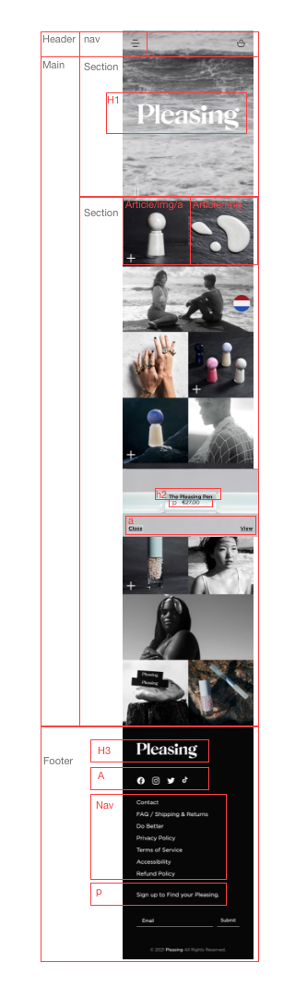

# Procesverslag
Markdown is een simpele manier om HTML te schrijven.  
Markdown cheat cheet: [Hulp bij het schrijven van Markdown](https://github.com/adam-p/markdown-here/wiki/Markdown-Cheatsheet).

Nb. De standaardstructuur en de spartaanse opmaak van de README.md zijn helemaal prima. Het gaat om de inhoud van je procesverslag. Besteedt de tijd voor pracht en praal aan je website.

Nb. Door *open* toe te voegen aan een *details* element kun je deze standaard open zetten. Fijn om dat steeds voor de relevante stuk(ken) te doen.

## Jij

uitwerken voor kick-off werkgroep

### Auteur:
Mila Smit

#### Je startniveau:
blauw

#### Je focus:
responsive
 

## Je website

uitwerken voor kick-off werkgroep

### Je opdracht:
Pleasing.com

#### Screenshot(s) van de eerste pagina (small screen): 
Hoofdpagina  

#### Screenshot(s) van de tweede pagina (small screen):
Detailpagina van The Pleasing Pen 

 

## Breakdownschets (week 1)

uitwerken na afloop 2e werkgroep

### de hele pagina: 

### de tweede pagina: 

### een dynamisch deel: 

## Voortgang 1 (week 2)

uitwerken voor 1e voortgang

### Stand van zaken
De html correct neerzetten ging goed, ik had al een beetje geprobeerd om verschillende dingen te positioneren maar dat was iets lastiger. Ook had ik moeite met de grootte van de afbeeldingen goed te maken. 

### Agenda voor meeting
samen met je groepje opstellen

| student 1      | student 2          | student 3    | student 4        |
| ---            | ---                | ---          | ---              |
| dit bespreken  | en dit             | en ik dit    | en dan ik dat    |
| en dat ook nog | dit als er tijd is | nog een punt | dit wil ik zeker |
| ...            | ...                | ...          | ...              |

### Verslag van meeting
hier na afloop snel de uitkomsten van de meeting vastleggen

- Mijn html zag er goed uit
- Ik moet alleen op de homepagina de afbeeldingen in articles zetten zodat ik ze makkelijker kan positioneren.

## Voortgang 2 (week 3)

uitwerken voor 2e voortgang

### Stand van zaken
De foto's in een grid zetten was vrij makkelijk, en het ging ook goed om een hamburgermenu te maken. Ik heb daarvoor de opdracht gevolgd die op dlo staat. Ik heb wel een beetje moeite met de groottes van de afbeeldingen, want iconen wil ik kleiner hebben dan andere afbeeldingen. Het is ook nogal lastig om de afbeeldingen te veranderen als er gehoverd wordt.

### Agenda voor meeting
samen met je groepje opstellen

| Mila           | student 2          | student 3    | student 4        |
| ---            | ---                | ---          | ---              |
| Ik heb mijn section een grid gegevenmaar dan ziet dat er ook zo uit op mijn tweede pagina  |
| | ...                | ...          | ...              |
|
|Moet ik van de buttons een linkje maken of niet?
|Alles hovered in een keer, hoe verander ik dat?

### Verslag van meeting
hier na afloop snel de uitkomsten van de meeting vastleggen

- de sections kan ik een class geven zodat ik ze apart kan stylen
- ik had gebruik gemaakt van divs om classes te geven aan de normale state en de hover state op de homepagina, maar ik kan daar beter ul gebruiken.
- de header zou ik ook in een ul kunnen zetten, dat ziet er netter uit. 
- Rowin heeft mij geholpen om de articles niet allemaal tegelijk te veranderen. Nu verandert alleen het stukje waar je overheen hovert

## Toegankelijkheidstest (week 4)

uitwerken na test in 8e voortgang

### Bevindingen
Lijst met je bevindingen die in de test naar voren kwamen:

VoiceOver:
- De VoiceOver las de website goed door, ook in de goede volgorde. Alleen de ingeklapte stukjes tekst niet (wat logisch is denk ik, want dan moet je erop klikken)

Toetsenbord:
- De navigatie kan niet geopend worden met het toetsenbord
- Als de navigatie wel geopend wordt, dan werkt de focus state wel voor de linkjes, maar het valt niet heel erg op.
- Als je hovert over de plaatjes zie je wel de focus state
- De navigatie in de footer wordt overgeslagen

Brillen:
- Met de bril 'Diabetic Eye Disease' kun je de website wel goed lezen, maar met de bril 'Blur/Glare' was de normale tekst te klein, en je kon de witte tekst op de grijze achtergrond niet goed lezen.

### Navigatie openen met toetsenbord
Als je met de tab door de website heen gaat, kun je niet op de menu knop drukken.

Ik denk dat het opgelost kan worden door een a te maken van de img, want het is nu alleen een img.

#### Focus state niet opvallend 
De focus state in de navigatie is nu niet heel opvallend.

Dit kan opgelost worden door het opvallender te maken met css.

#### Navigatie footer 
De navigatie in de footer wordt overgeslagen, en dat komt omdat het eigenlijk geen navigatie is, ik heb er gewoon een lijst van gemaakt, maar als ik er linkjes aan toevoeg, doet hij het waarschijnlijk wel.

#### Tekst niet goed leesbaar 
Met een van de brillen op, kon je de tekst op de site niet goed lezen, op een telefoon zou de tekst wel groot genoeg zijn waarschijnlijk, maar voor op een desktop moet het wel groter. Ook was het kleurcontrast niet groot genoeg tussen wit en lichtgrijs (logisch).

Dit kan opgelost worden door het lettertype groter te maken, en de kleuren aan te passen waardoor het wel leesbaar wordt.

## Voortgang 3 (week 4)

uitwerken voor 3e voortgang

### Stand van zaken
Ik had zelf best wel moeite om de hoverstate goed vorm te geven op de homepagina, dus ik heb aan Robert gevraagd of hij mij daarmee kon helpen, en toen is het gelukt. Ook had ik onder sommige afbeeldingen nog een kleine zwarte balk, die er niet moet zijn, en dat heb ik weggehaald.

Daarnaast heb ik op de pleasing pen pagina een afbeelding die bovenaan staat als het een klein scherm is, maar als het scherm groter wordt, komt hij links bij de andere afbeeldingen te staan, en ik wist niet hoe ik dat voor elkaar moest krijgen, dus ik heb hulp gevraagd aan Rowin, en nu heb ik de afbeelding er twee keer in staan, en op een klein scherm is de ene niet zichtbaar, en op een groot scherm is de ander niet zichtbaar. 

Verder heb ik de laatste vormgevingsdingen gedaan aan de website, vooral op de pleasingpagina, zoals witte balkjes tussen de details plaatsen, en de verschillende states vormgeven. Daar moet ik wel nog wat extra aandacht aan besteden.

### Agenda voor meeting
samen met je groepje opstellen

| Mila             | student 2          | student 3    | student 4        |
| ---              | ---                | ---          | ---              |
| Ik heb eigenlijk | en dit             | en ik dit    | en dan ik dat    |
| geen vragen..    | dit als er tijd is | nog een punt | dit wil ik zeker |
|                  | ...                | ...          | ...              |

### Verslag van meeting
hier na afloop snel de uitkomsten van de meeting vastleggen

- punt 1
- punt 2
- nog een punt
- ...

## Eindgesprek (week 5)

uitwerken voor eindgesprek

### Stand van zaken
hier dit ging goed & dit was lastig (neem ook screenshots op van delen van je website en code)

### Screenshot(s)

hier screenshot(s) van je eindresultaat

## Bronnenlijst

continu bijhouden terwijl je werkt

Nb. Wees specifiek ('css-tricks' als bron is bijv. niet specifiek genoeg).

1. https://www.w3schools.com/css/css_form.asp, voor het vormgeven van de formulieren.
2. https://codepen.io/robertspier/pen/LYjwBRQ?editors=1100, voor het hoveren over de foto's.
3. https://codepen.io/shooft/pen/zYzEPgv, voor het hamburgermenu.

